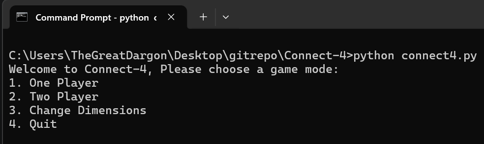
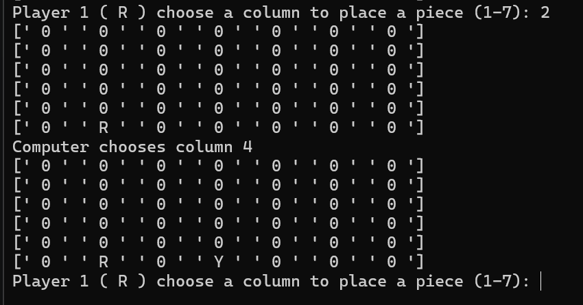
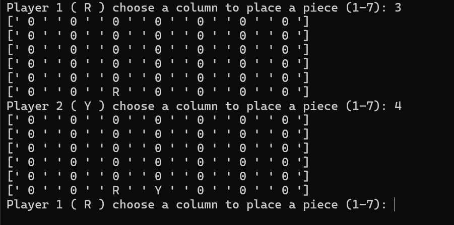
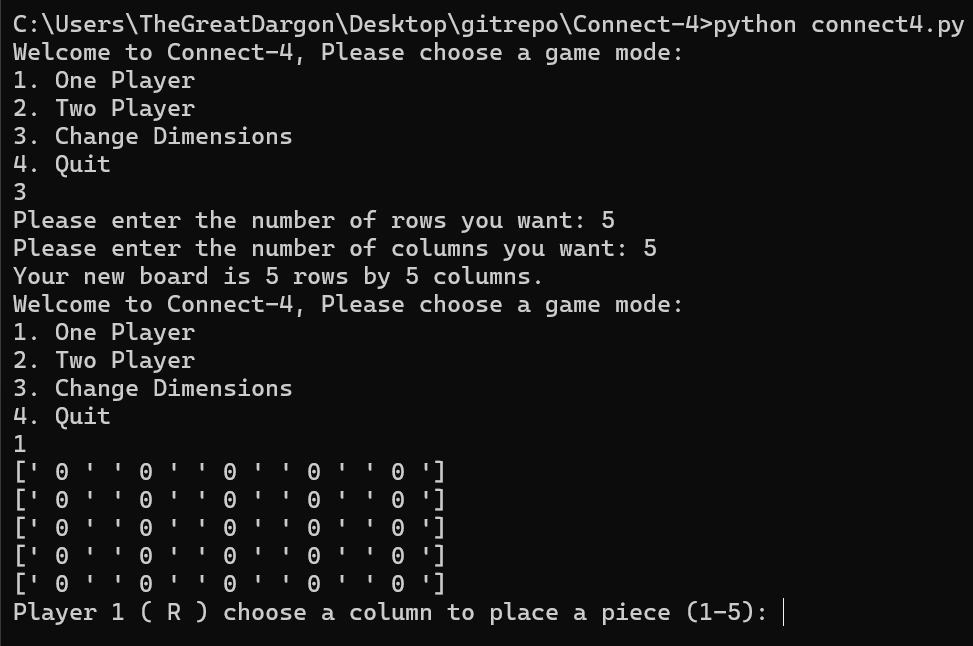

# Introduction

Objective: The goal of this project is to build a two-player version of the classic game [Connect Four](https://www.calculators.org/games/connect-4/).

Connect Four is played on a vertical grid of 6 rows and 7 columns. Two players take turns dropping one of their colored pieces into a column. The piece falls to the lowest available empty space within that column. The first player to get four of their pieces in a row—horizontally, vertically, or diagonally—wins the game. If the entire grid is filled and no player has won, the game is a draw.

In the next section I will go over my To-Do list. I will also provide a short description on how I am accomplishing this. And if I have any ideas for improvement which can be revisited later.

# How to Run

This game uses the libraries numpy and random, you will need to install these libraries before you can run it. I used pip as a package manager for python, if you use this, you can use the following commands to install them.

```
pip install numpy
pip install random
```

After installing the associated libraries you can run the program by running these commands depending on the version of python you have:

```
python connect4.py
```
or
```
python3 connect4.py
```

# Game Features

This game features two modes, one player and two player. It also allows you to change the dimensions of the board.

## Menu

To start the game gives you three menu options one player, two player, change dimensions and quit.



- [One Player](#one-player): Game against a computer
- [Two Player](#two-player): Game against another local player
- [Dimensions](#changing-dimensions): Information about changing the dimensions

## One Player

The one player mode is a game against a computer. The computer for this project is very simple just using random moves to play, this will be a very easy game. Maybe in the future I could support a more robust System I believe the structure is there as far as an output goes, and the input could just be the numpy 2d array board. Player one gets `R` and the Computer gets `Y` for red and yellow.



## Two Player

The two player mode is a game against another player. Player one will get `R` and Player two will get the `Y` piece. Maybe I could support some online features if I decide come back to the project again.



## Changing Dimensions

The option for changing dimensions allows the player to choose the rows and columns that they want. This changes the global variable for rows and columns so it will affect all other text and input/output for the functions of the program.



# To-Do

- [X] Create Board
- [X] Display the Board
- [X] Allow player to place Pieces
- [X] Check if a slot is empty
- [X] Implement "Gravity" to move pieces to bottom of column
- [X] Check if a column is full
- [X] Allow for 2 players
\- [X] Create win condition logic
    - [X] Create row win logic
    - [X] Create col win logic
    - [X] Create Diag win logic
- [X] Create a simple computer algorithm for one Player
- [X] Fix board not printing after selecting a full column
- [X] Add option for player to choose dimensions of board
